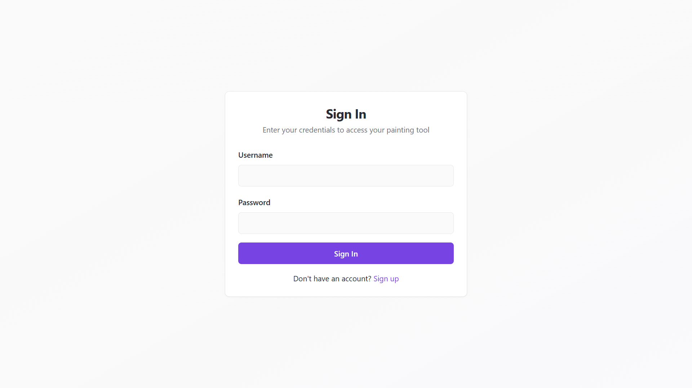
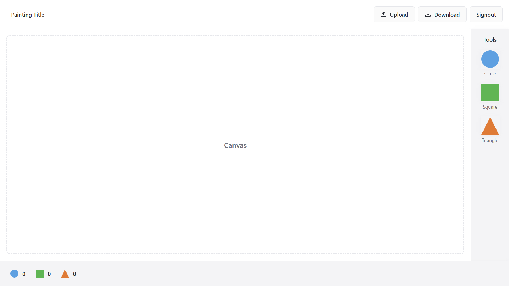

# تمرین دستگرمی سوم (نقاشی بکش لویی بخش دوم)

در این پروژه قسمت بکند ابزار نقاشی که در بخش قبل پیاده سازی کرده بودیم را با استفاده از Java Spring Boot پیاده سازی کرده ایم. امکانات اضافه شده در این بخش به شرح زیر است:

* اضافه شده صفحات sign up و sign in
* پیاده سازی قابلیت ثبت نام کاربران و نگه داری اطلاعات آن ها در پایگاه داده
* قابلیت آپلود نقاشی رسم شده (یکی به ازای هر کاربر) به پایگاه داده
* قابلیت دانلود نقاشی از پایگاه داده

## نحوه کارکرد برنامه

در تصویر زیر صفحه sign in مشاهده می شود که با وارد کردن نام کاربری و رمز عبور می توان وارد شد. همچنین در صورت نیاز به ثبت نام میتوان از صفحه sign up اقدام به اینکار کرد.

تصویر صفحه اصلی بوم نقاشی هم در زیر مشاهده می شود. می توان به کمک زدن دکمه upload نقاشی را وارد پایگاه داده کرد و یا به کمک دکمه download نقاشی را از پایگاه داده دریافت نمود.


## ساختار و نحوه کارکرد برنامه

در این بخش به توضیح فایل های مهم این پروژه میپردازیم:

* فایل controller/AuthController.java:
  این فایل حاوی endpoint های مربوط به Authentication می باشد.
* فایل controller/DrawingController.java:
  این فایل حاوی endpoint های مربوط به آپلود و دانلود نقاشی می باشد.
* فولدر dto:
  در این فولدر ساختار object هایی که در پروژه استفاده شده نگهداری می شود
* فایل entity/User.java:
  این فایل مشخصات موجودیت User نگهداری می شود که توسط JPA استفاده می شود.
* فولدر security:
  در این پوشه توابع مورد نیاز برای JWT پیاده سازی شده است.
* فایل service/AuthService.java:
  در این فایل توابع منطق مربوط به Authentication پیاده سازی شده است.
* فایل service/UserService.java:
  در این فایل توابع منطق مربوط به آپلود و دانلود نقاشی ها و همچنین رجیستر کردن یوزر ها پیاده سازی شده است.

## ساختار پایگاه داده

```sql
CREATE TABLE users (
    id BIGSERIAL PRIMARY KEY,
    username VARCHAR(50) UNIQUE NOT NULL,
    password VARCHAR(255) NOT NULL,
    drawing VARCHAR(1048575)
);
```

## تکنولوژی های مورد استفاده

* Java Spring Boot
* PostgreSQL
